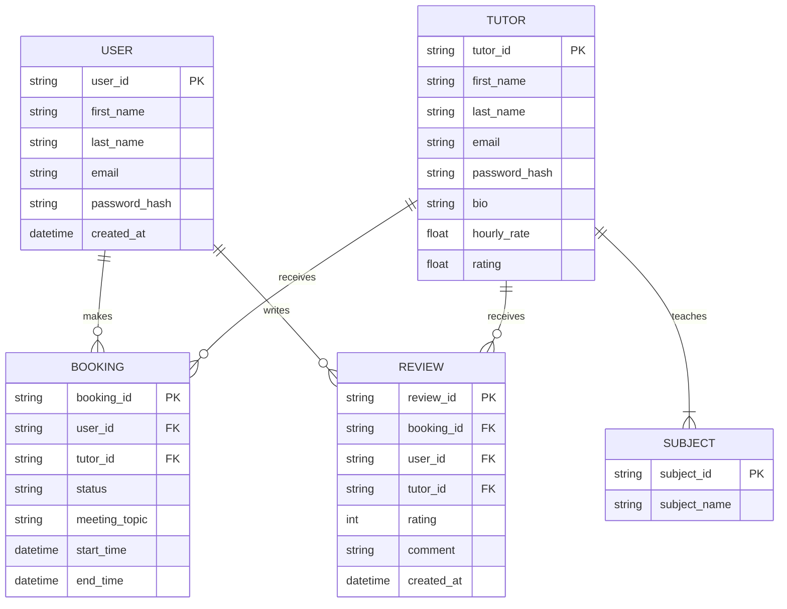

# Database Design Document
**Lab 9 Preparation**

This document outlines the database design for TutorConnect.

## 1. Entities
1. **User** (Students)
2. **Tutor**
3. **Subject**
4. **Booking**
5. **Review**

## 2. Entity Relationship Diagram (ERD) Explanation
- A **User** can have many **Bookings** (1:N).
- A **Tutor** can have many **Bookings** (1:N).
- A **Tutor** can teach many **Subjects** (M:N).
- A **User** can leave many **Reviews** for **Tutors** (1:N from User, 1:N from Tutor).
- A **Booking** involves exactly one **User** and exactly one **Tutor** (1:1 from Booking perspective).



## 3. Example Schema (SQL)

```sql
CREATE TABLE Users (
    user_id UUID PRIMARY KEY,
    first_name VARCHAR(100) NOT NULL,
    last_name VARCHAR(100) NOT NULL,
    email VARCHAR(255) UNIQUE NOT NULL,
    password_hash VARCHAR(255) NOT NULL,
    created_at TIMESTAMP DEFAULT CURRENT_TIMESTAMP
);

CREATE TABLE Tutors (
    tutor_id UUID PRIMARY KEY,
    first_name VARCHAR(100) NOT NULL,
    last_name VARCHAR(100) NOT NULL,
    email VARCHAR(255) UNIQUE NOT NULL,
    password_hash VARCHAR(255) NOT NULL,
    bio TEXT,
    hourly_rate DECIMAL(10, 2) NOT NULL,
    rating DECIMAL(3, 2) DEFAULT 0.0
);

CREATE TABLE Subjects (
    subject_id UUID PRIMARY KEY,
    subject_name VARCHAR(100) UNIQUE NOT NULL
);

CREATE TABLE TutorSubjects (
    tutor_id UUID REFERENCES Tutors(tutor_id),
    subject_id UUID REFERENCES Subjects(subject_id),
    PRIMARY KEY (tutor_id, subject_id)
);

CREATE TABLE Bookings (
    booking_id UUID PRIMARY KEY,
    user_id UUID REFERENCES Users(user_id),
    tutor_id UUID REFERENCES Tutors(tutor_id),
    status VARCHAR(50) DEFAULT 'Pending',
    meeting_topic VARCHAR(255),
    start_time TIMESTAMP NOT NULL,
    end_time TIMESTAMP NOT NULL
);

CREATE TABLE Reviews (
    review_id UUID PRIMARY KEY,
    booking_id UUID REFERENCES Bookings(booking_id),
    user_id UUID REFERENCES Users(user_id),
    tutor_id UUID REFERENCES Tutors(tutor_id),
    rating INT CHECK (rating >= 1 AND rating <= 5),
    comment TEXT,
    created_at TIMESTAMP DEFAULT CURRENT_TIMESTAMP
);
```
